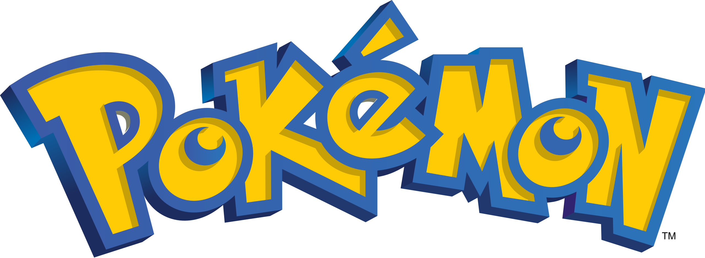

## *Inhaltsverzeichnis*

**================================**

1. kurzes Vorwort
2. Auflistung der Features
3. Verwendete Techniken
4. Frameworks

**================================**

1. kurzes Vorwort
   
Dieses Projekt ist im Rahmen meiner Weiterbildung zum App-Entwickler entstanden. Bei diesem Projekt wurden in erster Linie die Anforderungen der Prüfungsrichtlinien erfüllt.

<!-- Wie kam es zum Projekt -->

Wie kam es zum Projekt

  
### Projekt Pokemon Battle

> Die Idee ein Pokemon Spiel ohne Kommerziellen Hintergrund zu erstellen, kam mir bei einem gemütlichen Abend wo in meinem Freundeskreis die Kids teilweise "Pokemon Go" gespielt haben. 
Es gab aber auch kleinere Kinder die nicht die Möglichkeit hatten oder auch Kinder die es nicht durften da die Eltern zuviel Angst haben das deren Kind evtl ausversehen Geld ausgibt in dem Spiel oder 
in eine Abo Falle rutscht. Da kam mir die Idee wie cool wäre es wenn, es ein kleines Spiel gibt so als "Fan to Fan" Projket ohne das ich daran Geld verdiene. Ich habe dann geschaut ob es sowas schon in irgendeiner Art gibt.
Nach dem ich nichts gefunden was zu 100% kostenlos ist, habe ich das Prjekt geplant und angefangen es um zu setzen. 

